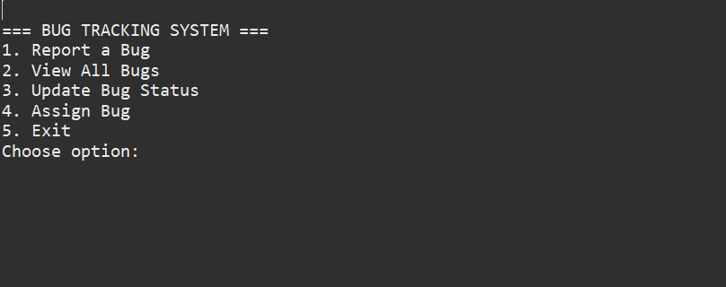
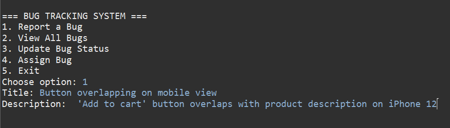
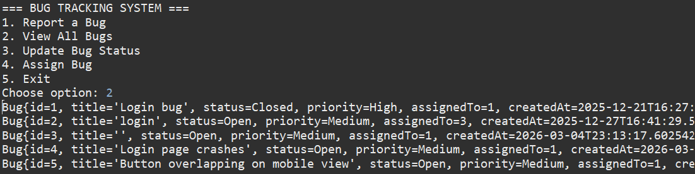

\# Bug Tracking \& Analysis System


\## Project Description


This project is a bug tracking system designed to store, manage, and analyze software bugs for developers.

It demonstrates database design, SQL analytics, and business insights for software quality management.


\*\*Purpose:\*\*


\- Track bug status, priority, and assignments

\- Analyze workload distribution

\- Identify aging bugs and backlog risks

\- Showcase SQL and data analytics skills


\## Tech Stack


\- Java (Eclipse IDE)

\- PostgreSQL

\- SQL

\- Optional Visualization: Power BI / Tableau


\## Application Screenshots


*Figure 1: Main menu with all options*


*Figure 2: Reporting a new bug*


*Figure 3: List of all bugs in the system*


\## Database Schema


\### users table


|  **Column**  |  **Type**  |  **Description**  |
| :----------- | :--------- | :---------------- |
| user_id      | integer    | Primary key       |
| name         | varchar    | Developer name    |


\### bugs table


|  **Column**       |  **Type**       |  **Description**                                         |
| :---------------- | :-------------- | :------------------------------------------------------- |
| bug_id            | integer         | Primary key                                              |
| title             | varchar         | Short bug title                                          |
| description       | text            | Detailed bug description                                 |
| status            | varchar         | Bug status ('Open', 'In progress', 'Resolved', 'Closed') |
| priority          | varchar         | Bug priority ('Low', 'Medium', 'High', 'Critical')       |
| assigned_to       | integer         | FK → users.user_id                                       |
| created_at        | timestamp       | Bug creation timestamp                                   |


\*\*Relationships:\*\*

* 'bugs.assigned\_to' → 'users.user\_id' (one bug is assigned to one developer)


\## Sample Data


\### Users


|  **user_id**    |  **name**     |
| :-------------- | :------------ |
| 1               | Alice         |
| 2               | Bob           |
| 3               | Charlie       |


\### Bugs


|  **bug_id**   |  **title**               |  **status**       |  **priority**     |  **assigned_to**   |  **created_at**                 |
| :------------ | :----------------------- | :---------------- | :---------------- | :----------------- | :------------------------------ |
| 1             | Login bug                | Closed            | High              | 1                  | 2025-12-21 16:27                |
| 2             | Login with false infos   | Open              | Medium            | 3                  | 2025-12-27 16:41                |


\## SQL Analysis Queries


1\. \*\*Bugs by Status\*\*

```sql

SELECT status, COUNT(\*) AS bug_count

FROM public.bugs

GROUP BY status;

```


2\. \*\*Bugs by Priority\*\*

```sql

SELECT priority, COUNT(\*) AS bug_count

FROM public.bugs

GROUP BY priority;

```


3\. \*\*Developer Workload\*\*

```sql

SELECT u.name AS developer, COUNT(b.bug_id) AS assigned_bugs

FROM public.users u

LEFT JOIN public.bugs b ON u.user_id = b.assigned_to

GROUP BY u.name

ORDER BY assigned_bugs DESC;

```


4\. \*\*Aging/Open Bugs\*\*

```sql

SELECT bug_id, title, status, priority, created_at, 

&nbsp;      CURRENT_DATE - created_at::date AS days_open

FROM public.bugs

WHERE status IN ('Open', 'In progress')

ORDER BY days_open DESC;

```


5\. \*\*Monthly Bug Trend\*\*

```sql

SELECT DATE_TRUNC('month', created_at) AS month, COUNT(\*) AS bug_count

FROM public.bugs

GROUP BY month

ORDER BY month;

```


6\. \*\*Unassigned Bugs\*\*

```sql

SELECT bug_id, title, status, priority

FROM public.bugs

WHERE assigned_to IS NULL;

```


## Business Insights
|       **Query**     |         **Business Question**           |            **What It Tells Us**                    |
| :------------------ | :-------------------------------------- | :------------------------------------------------- |
| Bugs by Status      | How healthy is our development process? | Too many "Open" bugs = backlog risk                |
| Bugs by Priority    | Are we focusing on critical issues?     | High/Critical bugs need immediate attention        |
| Developer Workload  | Who is overloaded?                      | Balance assignments across team                    |
| Aging Bugs          | Which bugs are stuck?                   | Old "Open" bugs need priority                      |
| Monthly Trends      | Is bug reporting increasing?            | Spike might indicate quality issues                |
| Unassigned Bugs     | Are bugs slipping through?              | Every bug needs an owner                           |


## How to Run This Project

### Prerequisites
- Java 8 or higher
- PostgreSQL 12 or higher
- Eclipse IDE (recommended)

### Database Setup
1. Make sure PostgreSQL is installed and running
2. Use the existing **postgres** database (it's created by default):
   ```sql
   -- No need to create a new database
   -- Just connect to 'postgres'
   ```
3. Run the schema script to create tables:
   ```bash
   psql -d postgres -f database/schema.sql
   ```
4. Insert sample data:
   ```bash
   psql -d postgres -f database/sample_data.sql
   ```

### Java Setup
1. Clone this repository
2. Open Eclipse → File → Import → Existing Projects into Workspace
3. Add PostgreSQL JDBC driver to build path
4. Update database credentials in `DBConnection.java`:
  ```java
  private static final String URL = "jdbc:postgresql://localhost:5432/postgres";
  private static final String USER = "postgres";
  private static final String PASSWORD = "your_password"; // Change to your PostgreSQL password
  ```
5. Run Main.java


### Run SQL Queries
All analysis queries are listed in the **SQL Analysis Queries** section above. You can run them directly in:
- **pgAdmin** (PostgreSQL's graphical interface)
- **psql** command line
- Any PostgreSQL client

These queries help answer real business questions about:
- Development process health (Bugs by Status)
- Critical issue tracking (Bugs by Priority)
- Team workload balance (Developer Workload)
- Backlog management (Aging Bugs)
- Quality trends over time (Monthly Bug Trend)
- Assignment gaps (Unassigned Bugs)


